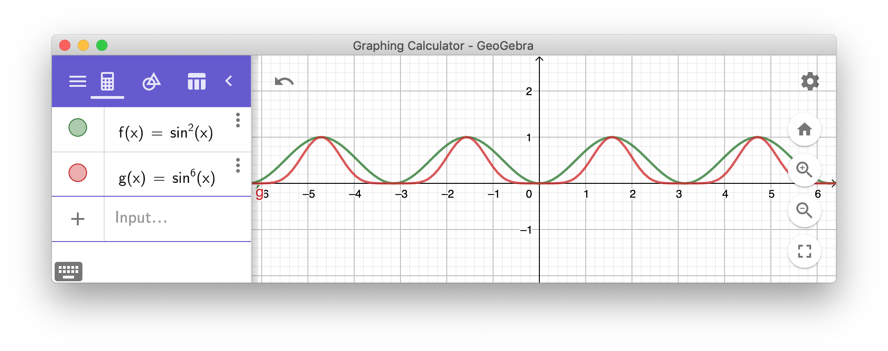
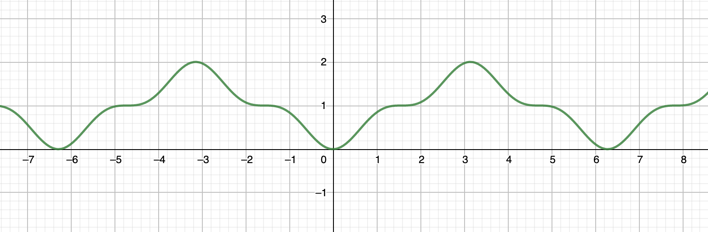
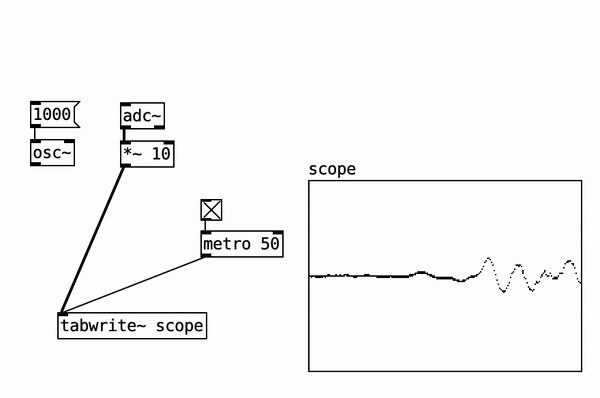
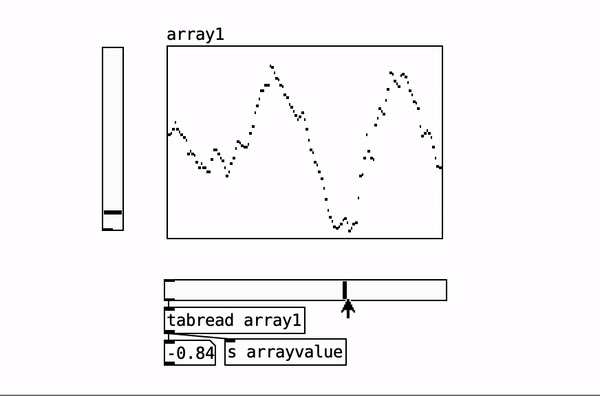
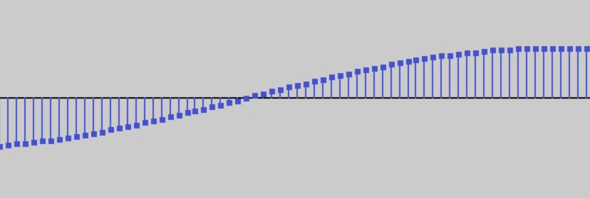
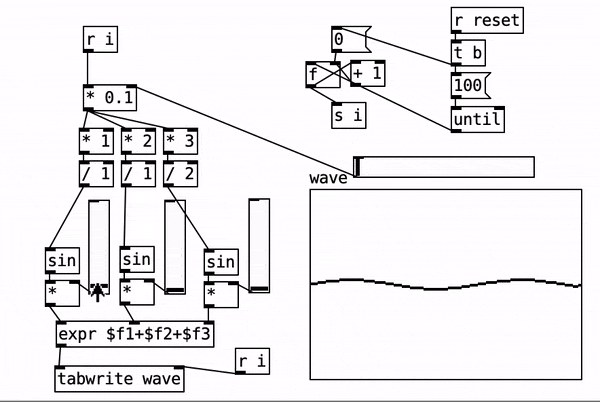

# 10: Fourier Systems

### Class Overview

1. Introduction
2. pure data
3. imaginary numbers
4. fourier introduction, adding sine waves, partials

### Recap from last class

## Introduction: Airplane sketch (20 min)

**Prep**: grab a url for a drawing of an airplane

make an animated p5.js sketch where an airplane is floating up and down in a sinusoidal animation.

how do you speed up and slow down the animation?

how do you increase the floating amount?

```javascript
sin(t * speed) * amp
```

Use a graphing calculator to rapidly prototype your equations. Three options:

- Grapher. Mac app included in MacOS (software clearly neglected by Apple)
- [Geogebra](https://www.geogebra.org/graphing) (possible to download but this downloaded version is not great in very cross-platform way)
- [Desmos](https://www.desmos.com/calculator) (works online)

Presently in 2020, Apple has invested years of neglect toward their Grapher app, it's not great. Geogebra and Desmos are comparible, I think I prefer Desmos.



### Takeaway: keyframes vs. functions

Keyframes are hard-cuts in segmenting time. Something like using if-statements

```javascript
// divide "time" into 4 buckets:
if (time % 4 < 1) { return sin(t); }
else if (time % 4 < 2) { return cos(t) + 1; }
else if (time % 4 < 3) { return -sin(t); }
else { return cos(t) - 1; }
```

can you re-create this function? it's like a sine curve, but when the sine curve gets to the top, it goes up one more time instead of back down.



If possible, don't think in these if statements! (this can be done in one equation)

There is a benefit to using single equations, if there is an option. We will see this in a later class when we do distance-function shader drawing.

## Pure Data

### [scope.pd](pd/scope.pd)

demonstrates how arrays can be used to peek into signals. it also demonstrates pd running in a pretty responsive and vibrant manner, nice to see for pure data beginners.



### [read-array.pd](pd/read-array.pd)

demonstrates how to pull numbers out of an array by supplying an index. it also demonstrates how an array is editable; you can drag the points around with a mouse, which btw, these points releate to each individual floating point in the sample.

> good time to talk about the Nyquist limit



zoom-in enough in Audacity and you can see each individual floating point number



### Nyquist Limit

At some point, there are no more samples, or "pixels" of the sound file. one implication is that the highest frequency possible to represent is one that vibrates at **half** the sample rate, right? because a sound needs to go up, then back down again in the span of the frequency. What's the shape of this sound?- a triangle wave. There's another downside you don't have much say for the shape of high frequencies. The standard **sample rate** used for audio CDs is 44.1 kilohertz (44,100 hertz) which is twice the upper limit of human hearing (about 20k).

### [write-array.pd](pd/write-array.pd)

demonstrates the lesson of today, a wave can be made of other waves.

waves are added. you can demonstrate this by replacing all the addition signs in the `expression $f1+$f2+$f3` with multiplication  `expression $f1*$f2*$f3`  and none of the wave will be visible if one of the waves is 0. because multiplication.




## Imaginary Numbers

Three parts

1. intuitive understanding by rotation
2. any point can be described by a combination of real and imaginary parts
3. word problem: changing your velocity (x/y components) with a rotation

in the world problem, a **rotation is a multiplication** of 2 complex numbers.

```
(3 + 4i) * (1 + i)
3 + 4i + 3i + 4(-1)
-1 + 7i
```

for a sanity check let's use the same tool, a 45 degree rotation but instead of using 1s use 2s.

```
(3 + 4i) * (2 + 2i)
6 + 8i + 6i + 8(-1)
-2 + 14i
```


## Fourier series, Fourier synthesis, FFT

> show a 

what is a **linear transform**? something that is invertable. this is the key of it. what does it preserve?

okay so let's back up a second.

let's say you have a sound file. what format is that sound file in? *is it uncompressed?* an array of numbers.

how can you visualize the waveform.

[Quake on Oscilloscope](https://www.youtube.com/watch?v=aMli33ornEU)

### Discrete Fourier Transform

[Dan Shiffman's Coding Train coding challenge](https://thecodingtrain.com/CodingChallenges/130.1-fourier-transform-drawing.html)

[Wikipedia page](https://en.wikipedia.org/wiki/Discrete_Fourier_transform)

first of all why is this even useful? [watch **one minute** of this video starting at 10:36](https://youtu.be/spUNpyF58BY?t=636)

Discrete Transforms involve the sum (from 0 to N). Let's make sure we understand the SUM function.


can you convert this into sum formula? (can you convert it into for-loop notation?) [solution](https://en.wikipedia.org/wiki/Madhava_of_Sangamagrama#The_value_of_π_(pi))

sine waves: amplitude, frequency, phase. operations on waves, addition, multiplication. the conversion of complex information into lightweight by fourier representation.


this code re-creates the idea in this gif

```javascript
function setup() {
  createCanvas(400, 400);
}

function draw() {
  let wave = Array(400).fill(0);
  
  var upper = mouseX / 10 + 2;

  for (let r = 1; r < upper; r += 2) {
    for (let i = 0; i < wave.length; i++) {
      wave[i] += sin(i/20 * r) / r * 100;
    }
  }
  
  background(220);
  for(let i = 0; i < wave.length - 1; i++) {
    line(i, 200+wave[i], i+1, 200+wave[i+1]); 
  }
}
```

play around with this code, can you get other shapes?

### Classwork

Linkages, Fourier drawing.

### References

[Toby Schachman Shadershop](http://tobyschachman.com/Shadershop/)

[@ChocoLinkage](https://twitter.com/ChocoLinkage) in this video he teaches you [how to make a 4 bar linkage](https://twitter.com/ChocoLinkage/status/1195732460249571328)

[Theo Jansen's Strandbeest](https://www.strandbeest.com/)

recap from last class: [hyperbolic sunflower](https://twitter.com/ZenoRogue/status/1247900522905886723)

## Homework

watch [3blue1brown's Fourier video](https://www.youtube.com/watch?v=spUNpyF58BY)

can you repurpose dan shiffman's sketch with a vector file? Like, the island of Manhattan. can you lower the frequencies?

Make a linkage in Geogebra, or in the real world!

## Appendix

Fourier Epicycles

from Dan Shiffman, Coding Train coding challenge #130

[link to sketch](https://svg.rabbitear.org/?code=M4Nw5gdMCWBeCmAKAtANgDQAI1YIwAY98BKAbgChRJgAXAJwHsBreAdWgBMaALRfCfACYy5cgGMGAO1qYOAMxqYAvJjkBXSWJrQpmRAA9imAN7lMmCdMUANZZgDaAXQrnLMgHJ39EADbxJYDwuqgx0en6KTHb4pJhRADyY7rFRANQquEam5uYRmHTw0cG58IrQALZFZjlyoeGlmJJFjZiJyS3pmJkm1TkWUjI8pQCGdogAssM8EAAKAJIAVIKYC3ErjUYA9EnFOQWYnfr2ko7rk9MSwIhDNMMifeYV2CpHJ2dT3FDQktfcI-c5AC+vXyhRU+22yRBTxUT0huzcijkBQAjnYmAiBophuUAA52c6fYAoug0RD7Vb7VKYJ6rCoA1xYzC47jDYBgzCEiBTYaSQSICpYAoMzDWexMU4qYygrCC1SorA43FYFlswqA4LA8wFGhqOhNawUDWiRGYeC46BiACeYj8wDs6k02l0BiwVqwtT10HgdCFDEUKhIPXMtTCiDy0GakcSnro3rovn8gW4sUjnW62RyeVxBRA+i8u2zuatditmKs8vgaJUsfj9mgjggyKr5ZkdGGHGgantNYYXp99cbStbilV7IdfbjA4bEDH8F2+c67c73feFwYV2baNW2nKhWpc4O+X9IpLS47Xftqy5MB+W-Wu-3zNZ4+pjBoIqoEDE0DotqQObwHmKrFkKF7dsQILmE20A+D4iAAESSFI8AIZBDyYFA9DMEgCEAEY+MMYhMGhuxfj43wAbm+ggUB7qYDRmBWsQWGMCwiEFBwpHVFqoK6vqDiMVazjkMa5B5I+VR5PmKhOBQeQlrJInZh8dhyaIob1GUUatF0+AxDSBwZFk1SmqMsKbAQ+Brp88zrIIwTeLi3a8FylyIAAzAsdwAlas4uRMHxfD8ACs3nECIwKmrWPq2Co8hkoYFDRZO8YAJp2AliDMRQ5AxXQ1hQKEZKIMM6B4UYSgAHyYHh3J4tgmDDPVuIiPlaVFaSiCleVlU1XVSqNc1SoiJQ4CzoRimqBoWg6E0iDwCZ5hfgU5QMCA8AAMLcLBHAFD8AJfnhRFMGAjAaBwiAAOQAO47TQ8BXYd40UZISDIII6CEJ9JCsThiEAMRiMD3HLS9lF8OgH1fegwh-exCFAyDo2MhWeZ2Oalo2nakPYAALB6qWxVgJDBKaIBTZj1r-lcyAE5ghAhP2dBpVgXLzJswhk0yIBqXm9j4I4WAU-YuCOCJ5i4kFGjADtCiICAz2QK9SD84LwtHGLwsC0LmAgKLjgsbQbG4UjYig5g5EQyL6t61aBva7b+ti0b2EI2bFtfriDA+FaKuIFLPDoTk8O4QRJ1oSCMFwYhyFvdxplMlwBJBfMSyYNs+WFX4ARBNUkmdFwwTVNAch6JJNXs4swjBjkkmBrsgfcGpEuYMCGpAA)

[link to the code](dft.js)

if you want to use a custom shape, make the points in the form of a polyline. then find the spot in the code in the middle, paste this.

```
const shape = [
  [-0.0581,-0.5], [-0.5,-0.343], [-0.5,-0.2558],
  [-0.4186,-0.2849], [-0.4186,-0.0291], [0.4477,-0.0291],
  [0.4477,-0.2151], [0.5,-0.1919], [0.5,-0.2791],
  [0.2965, -0.436], [0.157,-0.3663]
];
for (let i = 0; i < shape.length; i += 1) {
  x.push(shape[i][0]);
  y.push(shape[i][1]);
}
const fourierX = dft(x);
const fourierY = dft(y);
```

