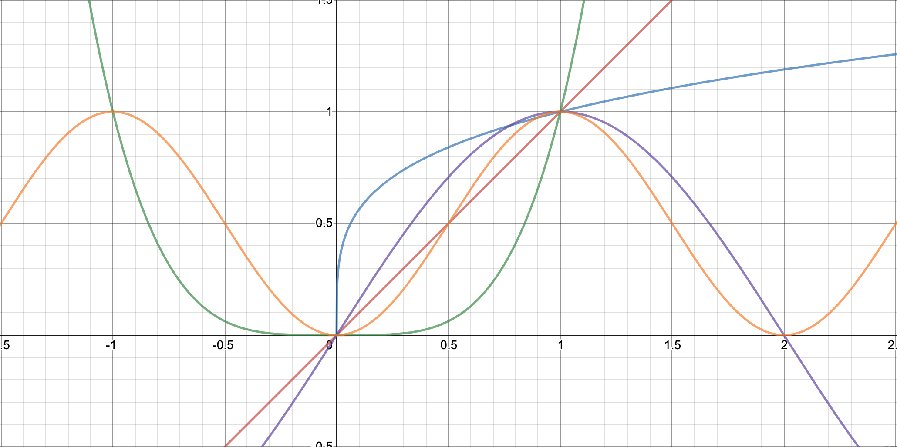
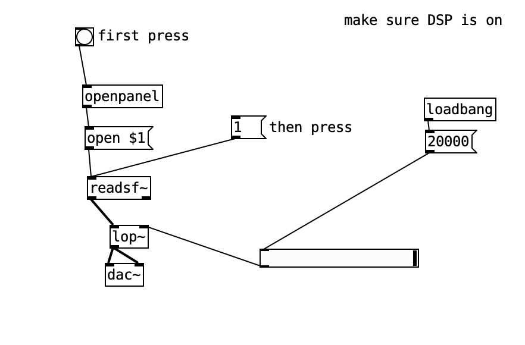
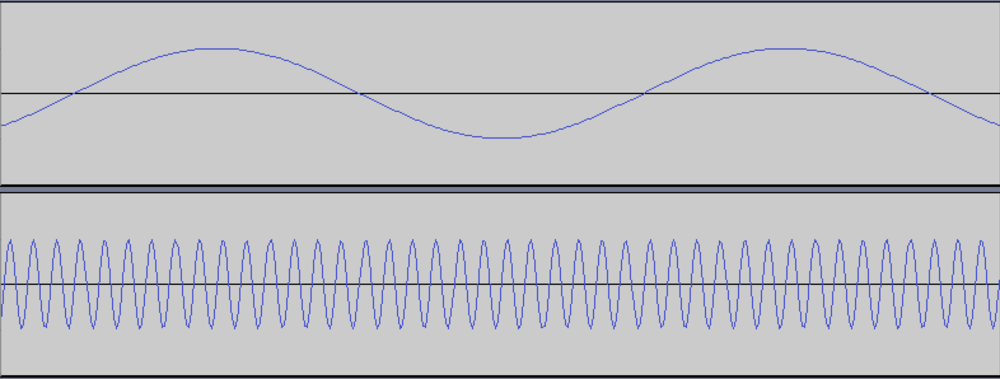
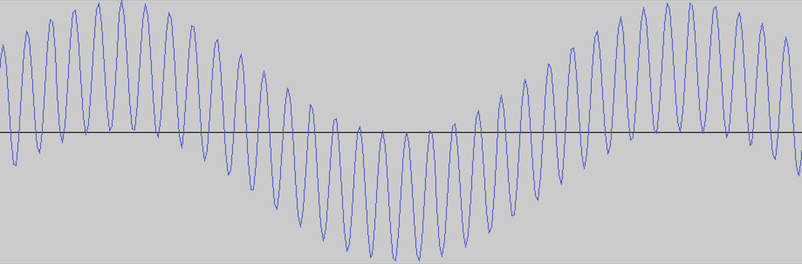
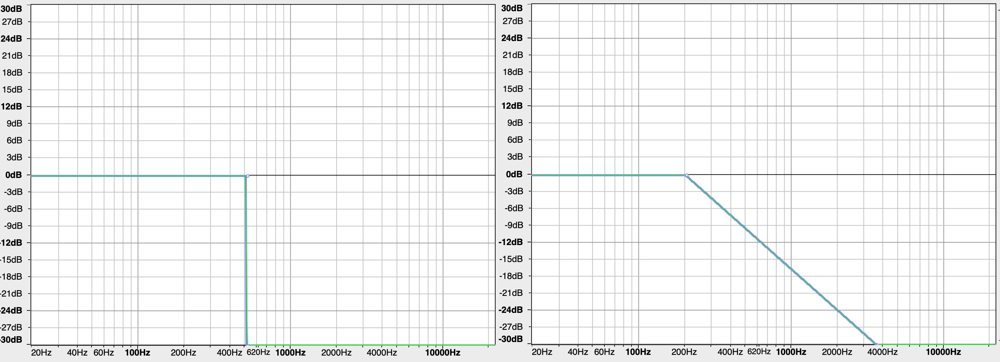
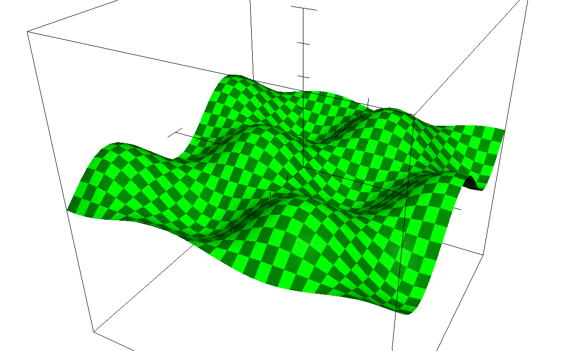

# 11: Number Shaping

### Review: Number Shaping

the importance of the UNIT interval. between 0...1.

The whole point is to be effortlessly alternate between addition-type operations and multiplication/scaling-type operations.

and one general application is animation curves. Lerp is just one kind of interpolation. cosine, cubic, catmull-rom.

Show them the graphs of sqrt, pow2, and y=x. change the pow2 to pow3 and 4, see how it exaggerates the curve. what about logarithmic? Sine? things that don't normally fit in between these spaces.



**SHAPING CHALLENGE**: random int between (13, 128) but, anything past 50 is unrecognizably similar, we need to front-load these numbers. more up front less in the back (this is the limits of map function ability)

## Recap: signal processing

"smoothing a sound file", running a LOP block in puredata. [link to pd file](low-pass.pd)



### Exercise: Audacity

create 2 tones: 200hz and 48,000hz, so that they are both in the same file.



mix down and export the file and open up the result:



now apply the low pass filter and watch it revert back to the low frequency. do the same with the high pass filter.

Think back to our epicycles sketch. this is the same as removing all the high frequencies, the small circles. 

**Photoshop curves**: have you noticed that photoshop curves doesn't like when there are hard-jumps. the smoother the function the better.



### Applications of Fourier in graphics: JPEG compression

color spaces

Discrete cosine transform: how JPEG compression works


play with DCT in grapher (it can do 3D easily), run the equation

```
z = cos(x) * sin(y)
```



### Epicycles vs. random

Randomness was big in the 1970’s, algorists employing randomness especially in visual art. Aleatoric music. Fluxus.

computer’s pseudo random generator, testing random number generators

can we pull up a sketch of random dots. compare against the random dots of a night sky.

the crashing of the ocean waves on the shore is not random. there is a regularity to the cycle within the randomness feeling.

There is a strange correlation between randomness and sine curves when we use Fourier to approximate a random sequence. especially if we smooth it out by removing the high ends.

Link: [Shepherding Random Numbers, by Anders Hoff](https://inconvergent.net/2016/shepherding-random-numbers/)

### xxx Recap: Logarithms

geometric progression vs. arithmetic progression

## Applications of complex numbers

did anybody explore complex numbers further?

How is the complex plane different from just using x and y axes?

for me it comes down to this:

### (a + b)²

```
(a + b) * (a + b)
```

in normal math, this expands into this form:

### (a+b)(a+b) = a² + 2ab + b²

but with complex numbers, you get the same thing except the b² is negative.

### (a+bi)(a+b𝒊) = a² + 2ab𝒊 + (b𝒊)²

and remember 𝑖² is -1, so it reduces into

### a² + 2ab𝒊 - b²

## Mandelbrot fractal

first, review the summary notation. iterations. how does a for-loop look in math notation

### ∑ aᵢ = a₁ + a₂ + a𝑛

a good way to understand it is looking at [arithmetic and geometric means](https://en.wikipedia.org/wiki/Average#Pythagorean_means)

code the mandelbrot fractal in p5.js.

## Recap: Linear algebra

Project: Create a 3D world that rotates around with your device gyroscope/accelerometer orientation, served via. ngrok, and uses dot and cross products to highlight or activate certain geometry in the world that is related to the user's viewpoint.

This is picking up where we left off from day 7 with the three.js introduction

```javascript
window.onload = function () {
	var camera = new THREE.PerspectiveCamera(
		70,
		window.innerWidth / window.innerHeight,
		0.01,
		1000
	);
	camera.position.z = 10;

	var scene = new THREE.Scene();

	// add geometry here
	var box = new THREE.BoxBufferGeometry(4, 4, 4,2, 2, 2);
	var material = new THREE.MeshBasicMaterial({
		color: 0xffffff,
		wireframe: true
	});
	var mesh = new THREE.Mesh(box, material);
	scene.add(mesh);

	var renderer = new THREE.WebGLRenderer({ antialias: true });
	renderer.setSize(window.innerWidth, window.innerHeight);
	document.body.appendChild(renderer.domElement);

	function animate() {
		renderer.render(scene, camera);
		requestAnimationFrame(animate);
	}
	animate();
};
```

### Conics

[extraoridnary conics](https://www.youtube.com/watch?v=X83vac2uTUs) can this relate to fourier transforms?

### History

History of Fractals and self-similarity. L-systems. some early ideas: Julia set, Cantor set.

### References

- The Book of Shaders- [Random](https://thebookofshaders.com/10/) + [Noise](https://thebookofshaders.com/11/)
- John D. Cook, "Testing a Random Number Generator”
